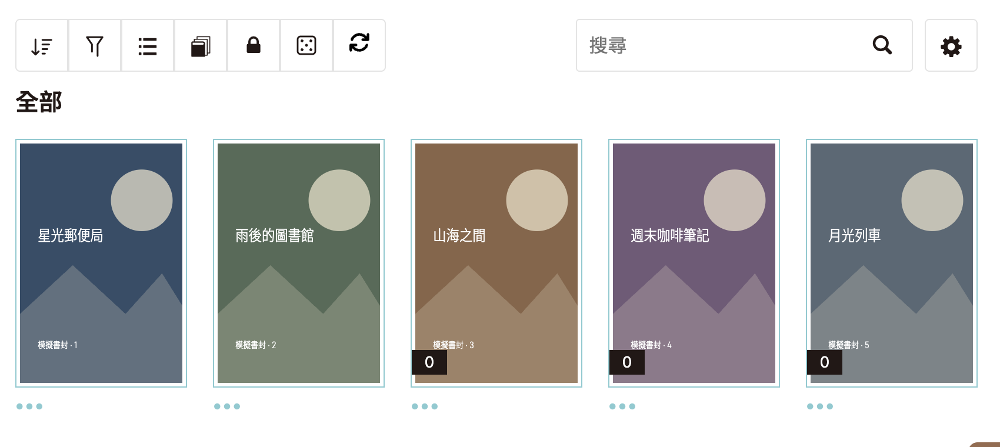
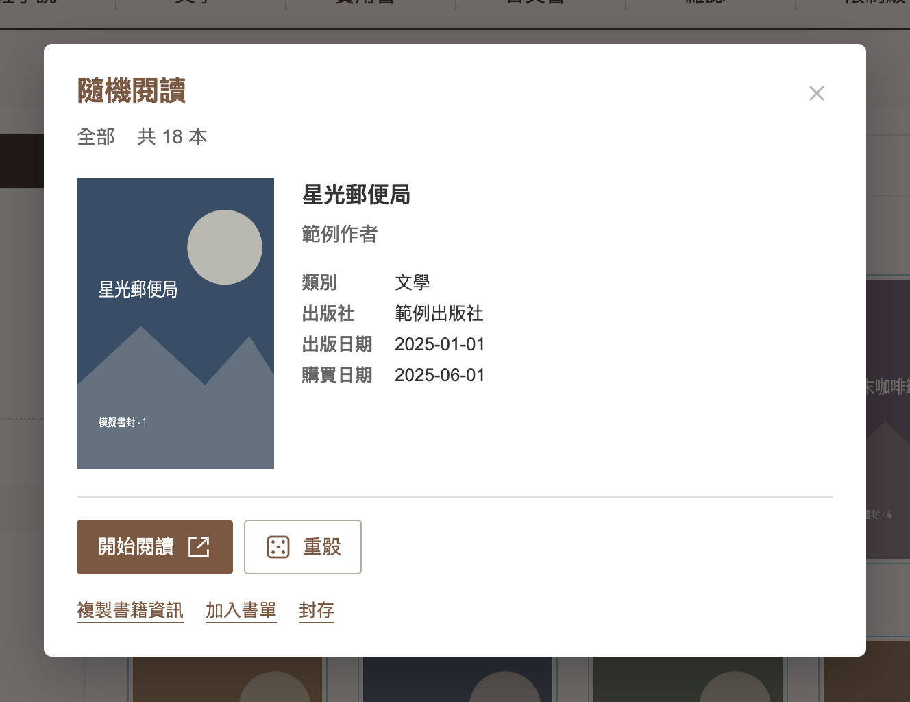

# BOOK☆WALKER 台灣書櫃隨機選書

從目前書櫃分類或自訂書單的全部分頁抽一本書。按「開始閱讀」就會開啟新分頁；想換一本，按「重骰」。

## 安裝

1. 安裝瀏覽器擴充功能 [Tampermonkey](https://www.tampermonkey.net/)。
2. 在 Chrome 開啟「擴充功能 → 管理擴充功能 → Tampermonkey → 詳細資料」，啟用「允許使用者指令碼（Allow User Scripts）」。若找不到此設定，依 [Tampermonkey 官方說明](https://www.tampermonkey.net/faq.php#Q209)操作。
3. 點選[安裝腳本](https://raw.githubusercontent.com/VdustR/monkey-script-bookwalker-tw-random-pick/refs/heads/main/dist/bookwalker-random-book.user.js)，在 Tampermonkey 畫面按「安裝」。
4. 登入 [BOOK☆WALKER 台灣](https://www.bookwalker.com.tw/)，開啟「線上書櫃」。已開啟的書櫃需重新整理。

書櫃工具列的封存按鈕旁會出現骰子。滑鼠移上去會顯示「從目前書櫃隨機選書」。

如果安裝連結只顯示文字，請在 Tampermonkey 管理介面新增腳本，把整份檔案貼進編輯器後儲存。保留一份啟用的版本即可。

## 使用

1. 選好書櫃分類、自訂書單及篩選條件。
2. 按骰子。第一次抽選會載入該範圍的全部分頁。
3. 按「開始閱讀」開啟新分頁，或按「重骰」換一本。

「複製書籍資訊」、「加入書單」與「封存」直接顯示在下方。加入書單與封存會交由原站的操作介面處理。

按「關閉」或 `Escape` 可關閉視窗。書櫃內容有變更時，重新整理後再抽。

### 畫面範例

截圖使用真實網站的版面與樣式。書籍、書封、作者、日期、最近閱讀、頭像與計數均已換成模擬資料。拍攝日期為 2026 年 10 月 8 日。點選圖片可檢視原始解析度。

<a href="docs/images/bookshelf.png"></a>

<a href="docs/images/random-reader.png"></a>

## 抽選範圍

- 保留目前分類、自訂書單與網址中的篩選條件，只切換分頁。
- 合併全部分頁並去除重複書籍，每本可閱讀的書被抽中的機率相同。
- 每次獨立抽選，可能連續抽中同一本。沒有閱讀連結的書不會加入抽選。
- 同時最多載入三個分頁。成功載入後沿用這份書目，直到重新整理。

## 更新與移除

更新時，重新點選[安裝腳本](https://raw.githubusercontent.com/VdustR/monkey-script-bookwalker-tw-random-pick/refs/heads/main/dist/bookwalker-random-book.user.js)，覆蓋原版本。目前採手動更新。

停用或移除腳本，請到 Tampermonkey 管理介面操作。

## 遇到問題

| 狀況 | 處理方式 |
| --- | --- |
| 找不到骰子 | 確認腳本已啟用、瀏覽器允許使用者指令碼，且位於[線上書櫃](https://www.bookwalker.com.tw/bookcase/available_book_list)或其分類、書單頁面，再重新整理。 |
| 沒有可抽的書 | 檢查分類與篩選條件；抽選只納入有閱讀連結的書。 |
| 分頁載入失敗 | 按「重新嘗試」。若登入或書櫃狀態有變，重新整理並確認登入。任一分頁失敗時會停止抽選。 |
| 出現重複按鈕 | 在 Tampermonkey 停用舊版，再重新整理。 |
| 出現 `Illegal invocation` | 安裝目前的 `dist` 版本；已修正原生 `fetch` 的呼叫綁定。 |
| 沒抽到新增的書 | 重新整理，讓腳本重新載入書目。 |

已驗證 Chrome 畫面、書目載入與模擬操作轉送。「加入書單」與「封存」尚未在真實帳號執行驗證；這兩項操作依賴原站的書櫃控制器。

## 隱私與權限

腳本使用 `@grant none`，只在符合條件的 BOOK☆WALKER 台灣書櫃頁面執行。分頁請求沿用原站的登入狀態，沒有分析追蹤或書目上傳。按下「複製書籍資訊」時才會寫入剪貼簿。

## 開發

需要 Node.js 22.12 以上與 npm；CI 使用 Node.js 24。

```sh
npm ci
npm run release
```

`npm run release` 會依序測試、檢查型別、建置並驗證腳本。產物位於 `dist/bookwalker-random-book.user.js`。

| 指令 | 用途 |
| --- | --- |
| `npm run check` | 檢查 Svelte 與 TypeScript 型別。 |
| `npm test` | 執行書目擷取、跨頁、去重、重試與原生 fetch 綁定測試。 |
| `npm run build` | 檢查型別、打包腳本與 CSS，驗證中繼資料、版本、權限與語法。 |
| `npm run dev` | 啟動本機測試頁面。 |

使用 Svelte 5、TypeScript 6、Vite 與 `@tsconfig/strictest`，確切版本記錄於鎖定檔。TypeScript 6 是目前與 `svelte-check` 相容的選擇，套件型別檢查保持啟用。

原始碼位於 `src/`。`tests/preview.html` 使用模擬資料與操作；`tests/native.html` 保留瀏覽器原生 fetch。

發布時將原始碼與建置後的 `dist` 一起提交至 repository，不建立 GitHub Release。詳見[建置與發布流程](docs/RELEASING.md)及[截圖製作方式](docs/SCREENSHOTS.md)。

## 授權

本專案程式碼與自製模擬素材採 [MIT](LICENSE) 授權。BOOK☆WALKER 的名稱、標誌與網站介面屬於各自權利人。本腳本為獨立專案。
